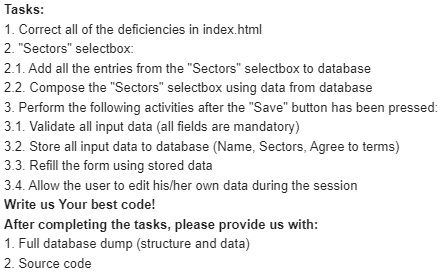

# User sectors picker

## Description

This project is a web application built with Java Spring Boot for the backend and React for the frontend. It involves managing tasks related to correcting deficiencies in the index.html file, handling a "Sectors" selectbox, and performing various activities upon clicking the "Save" button.

## Setup

### Prerequisites

- Java Development Kit (JDK) 17 or higher
- Node.js and npm package manager
- MySQL or any preferred database
- Optional: Docker

## Launch Options

### 1. Using Docker Compose

1. Clone the repository:

   ```bash
   git clone https://github.com/martinmakejev/helmes-technical-exercise
   ```

2. In the root directory, run the following command:
   **Note:** This will build the application in a Docker container.

   ```bash
   docker-compose up --build
   ```

3. The application should now be running on the following URL's:
   - http://localhost:8080/ - Backend
   - http://localhost:3000/ - Frontend

### 2. Using Gradlew and npm

1. Clone the repository:

   ```bash
   git clone https://github.com/martinmakejev/helmes-technical-exercise
   ```

2. Create a database for the project.

3. Configure the database connection in the `application.properties` file located in the `backend/src/main/resources` directory.

   - Update the `spring.datasource.url`, `spring.datasource.username`, and `spring.datasource.password` properties accordingly.
   - **Note:** If you are using a different database, you need to import the corresponding JDBC driver dependency in the `backend/build.gradle` file.
   - **Note:** On every Spring boot application startup, sectors are automatically added to the database.

4. Navigate to the `backend` directory and run the following command:
   **Note:** This will build the backend application.

   ```bash
   cd backend
   ```

   ```bash
   ./gradlew bootRun
   ```

5. Navigate to the `frontend` directory and run the following command:
   **Note:** This will build the frontend application.

   ```bash
   cd frontend
   ```

   ```bash
   npm install
   ```

   ```bash
   npm start
   ```

6. The application should now be running on the following URL's:
   - http://localhost:8080/ - Backend
   - http://localhost:3000/ - Frontend

## Insttruction to Run Tests

This project includes test to ensure the correctnes of the application
**Note:** Right now only backend tests are supported

### Backend tests

1. Ensure that you have all the required dependencies installed

2. Navigate to the `backend` directory

   ```bash
   cd backend
   ```

3. Run the following command to execute tests

   ```bash
   ./gradlew test
   ```

## Task description
